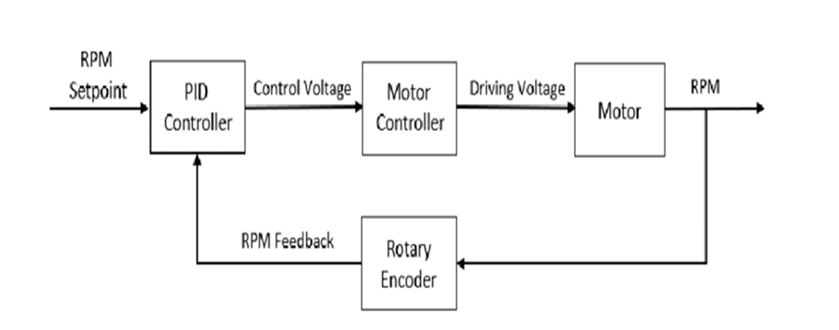

# rpm-controller-arduino-using-esu
Closed-loop RPM control system using Arduino and Hall-effect sensor with PWM-based speed regulation

## Problem Statement
Motor speed varies due to load, friction, and voltage changes, leading to inefficiency and instability. This project aims to maintain a constant RPM using a feedback-based control system.

## System Diagram

## Components
1. Arduino Uno
2. DC Gear Motor
3. Hall-effect Sensor
4. Servo Motor
5. Motor Driver

## How to Run
1. Connect Hall Sensor to the Arduino A0 pin
2. Connect the motor driver and DC motor
3. Power the system
4. Upload code using Arduino IDE
5. Monitor the Serial output for RPM

## Documentation
Full report available in report/project-report.pdf

